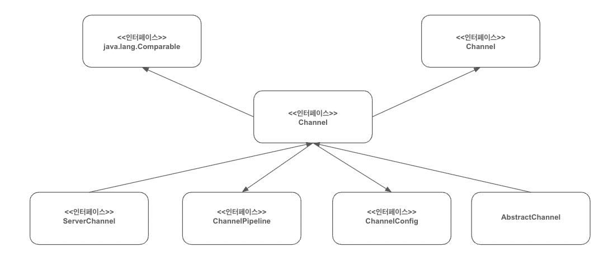
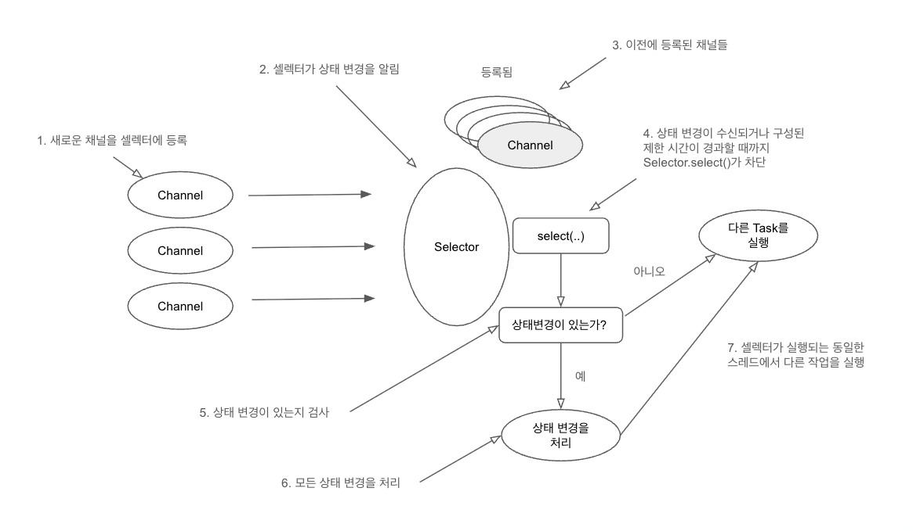
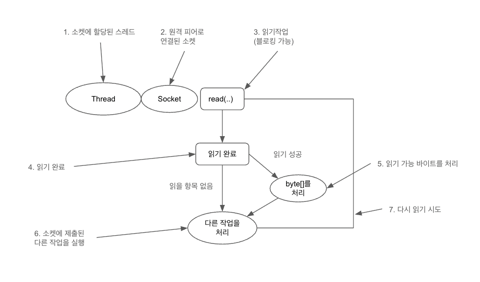

# netty-study

### Java 네트워킹

```java
public class SocketApplication {

    private static final int port = 8088;

    public static void main(String []args) {
        ServerSocket serverSocket = null;
        try {
            serverSocket = new ServerSocket(port);
            // accept() 호출로 연결될 때까지 진행을 블로킹한다.
            Socket clientSocket = serverSocket.accept();
            
            // 스트림 객체를 생성한다.
            // 문자 입력 스트림에서 텍스트를 읽는다.
            BufferedReader in = new BufferedReader(
                    new InputStreamReader(clientSocket.getInputStream())
            );
            // 객체의 포매팅된 표현을 테긋트 출력 스트림으로 출력한다.
            PrintWriter out = new PrintWriter(clientSocket.getOutputStream(), true);
            
            // 처리 루프를 시작한다.
            String request, response;
            // readLine() 을 통해 문자열을 읽을 때까지 진행을 블로킹한다.
            while ((request = in.readLine()) != null) {
                // 종료 신호가 들어오면 루프를 종료한다.
                if ("Done".equals(request)) {
                    break;
                }

                // client 요청을 처리한다.
                response = processRequest(request);
                out.println(response);
            }
        } catch (IOException e) {
            e.printStackTrace();
        }
    }

    private static String processRequest(String request) {
        return request;
    }
}

```

- 위의 코드는 JAVA API (java.net) 으로 Socket API 패턴의 예시이다.
- Socket API 는 블로킹 시스템 호출 방식으로 한 번에 한 연결만 처리한다. 
- 1개의 쓰레드가 1개의 연결만 처리하는 것을 의미하며, 연결이 종료되기 전까지 쓰레드는 대기상태로 유지된다.
- 각 쓰레드는 스택 메모리를 할당하는데, 기본 크기는 64KB 에서 1MB 정도 차지할 수 있다.
- JVM (Java virtual machine) 은 물리적으로 많은 수의 쓰레드를 지원하지만, 1만개 정도의 동시 접속이 진행될 때에는 컨텍스트 전환에 대한 오버헤드가 문제가 될 수 있다.

<br />


### JAVA NIO (new input output)

- 네트워크 소켓 라이브러리에는 네트워크 리소스 사용률을 세부적으로 제어할 수 있는 논블로킹(non-blocking) 호출이 포함되어 있다.
- setsockopt() 를 이용하면 데이터가 없을 때, 즉 블로킹 호출이라면 진행을 블로킹할 상황에서 읽기/쓰기 호출이 즉시 반환되도록 소켓을 구성할 수 있다.
- 시스템의 이벤트 통지 API 를 이용해 논블로킹 소켓의 집합을 등록하면 읽거나 기록할 데이터가 준비됐는지 여부를 알 수 있다.


<br />

### Selector


- java.nio.channels.Selector 클래스는 자바의 논블로킹 입출력 구현의 핵심, 논블로킹 Socket 의 집합에서 입출력이 가능한 항목을 지정하기 위해 이벤트 통지 API 를 이용한다.
- 하나의 쓰레드로 여러 동시 연결을 처리할 수 있다.
- 적은 수의 쓰레드로 더 많은 연결을 처리할 수 있으므로 메모리 관리와 컨텍스트 전환에 따르는 오버헤드가 감소한다.
- 입출력을 처리하지 않을 때는 쓰레드를 다른 작업에 활용할 수 있다.
- 그러나 직접 자바의 NIO API 를 이용해 네트워크 프로그래밍을 진행할 수 있지만 안정적인 네트워크 프로그래밍을 하기 어렵다.

<br />

### Netty

- 설계
  - 단일 API 로 블로킹과 논블로킹 방식의 여러 전송 유형을 지원
  - 단순하지만 강력한 스레딩 모델, 진정한 비연결 데이터그램 소켓 지원
  - 재사용 지원을 위한 논리 컴포넌트 연결

- 이용 편이성
  - javadoc 과 광범위한 예제, JDK 1.6 을 제외한 추가 의존성 없음

- 성능
  - 코어 자바 API 보다 높은 처리량과 짧은 지연 시간, 폴링과 재사용을 통한 리소스 소비 감소, 메모리 복사 최소화

- 견고성
  - 저속, 고속 또는 과부하 연결로 인한 OutOfMemoryError 가 발생하지 않음
  - 고속 네트워크 상의 NIO 애플리케이션에서 일반적인 읽기/쓰기 불균형이 발생하지 않음

- 보안
  - 완벽한 SSL/TLS 및 StarTLS 지원, 애플릿이나 OSGi 같은 제한된 환경에서도 이용 가능

<br />

### 비동기식 이벤트 기반 네트워킹

- 발생하는 이벤트에 대해 언제든지, 순서에 관계없이 응답할 수 있어야 한다.
- 증가하는 작업량에 맞게 적절히 처리할 수 있는 시스템, 네트워크, 프로세스의 능력 또는 이러한 작업량 증가에 맞게 규모를 늘리는 능력
- 셀렉터는 적은 수의 스레드로 여러 연결에서 이벤트를 모니터링할 수 있다.

<br />

### 네티의 핵심 컴포넌트

- Channel
  - 하나 이상의 입출력 작업(읽기 또는 쓰기)을 수행할 수 있는 하드웨어 장치, 파일, 네트워크 소켓, 프로그램 컴포넌트와 같은 엔티티에 대한 열린 연결


- Callback
  - 다른 메서드로 자신에 대한 참조를 제공할 수 있는 메서드
  - 다른 메서드에서 이 참조가 가리키는 메서드를 필요할 때 호출할 수 있다.
  - 관심 대상에게 작업 완료를 알리는 가장 일반적인 방법
  - channelActive(ChannelHandlerContext ctx)


- Future
  - 작업이 완료되면 이를 애플리케이션에게 알리는 방법
  - ChannelFuture 에는 ChannelFutureListener 인스턴스를 등록할 수 있어 작업 완료 여부를 리스너로 알 수 있다.


- Event, Handler
  - 이벤트 동작 : 로깅, 데이터 변환, 흐름 제어, 애플리케이션 논리
  - 인바운드 이벤트 : 연결 활성화 또는 비활성화, 데이터 읽기, 사용자 이벤트, 오류 이벤트
  - 아웃바운드 이벤트 : 원격 피어로 연결 열기 또는 닫기, 소켓으로 데이터 쓰기 또는 플러시


<br />

# 네티 컴포넌트와 설계

- 자바 NIO 기반의 비동기식 이벤트 기반 구현을 이용해 고부하 조건에서도 애플리케이션 성능과 확장성을 최대한으로 보장한다.
- 애플리케이션 논리를 네트워크 레이어로부터 분리하는 다양한 설계 패턴을 활용해 코드의 테스트 용이성, 모듈성, 재사용성을 극대화 한다.

<br />

### Channel, EventLoop, ChannelFuture

- Channel : 소켓 (Socket)
- EventLoop : 제어 흐름, 멀티스레딩, 동시성 제어
- ChannelFuture : 비동기 알림

<br />

### Channel Interface

- EmbeddedChannel
- LocalServerChannel
- NioDatagramChannel
- NioSctpChannel
- NioSocketChannel

<br />

### EventLoop 인터페이스

- 한 EventLoopGroup 은 하나 이상의 EventLoop 를 포함한다.
- 한 EventLoop 는 수명 주기 동안 한 Thread 로 바인딩 된다.
- 한 EventLoop 에서 처리되는 모든 입출력 이벤트는 해당 전용 Thread 에서 처리된다.
- 한 Channel 은 수명주기 동안 한 EventLoop 에 등록할 수 있다.
- 한 EventLoop 를 하나 이상의 Channel 로 할당할 수 있다.

<br />

### ChannelFuture 인터페이스

- 네티의 모든 입출력 작업은 비동기로 작업이 즉시 반환되지 않을 수 있기 때문에 나중에 결과를 확인할 수 있는 방법이 필요하다.
- ChannelFutureListener 를 등록하면 작업 여부에 대한 알림을 받을 수 있다.

<br />

### ChannelHandler 와 ChannelPipeline

- ChannelHandler 의 메서드가 네트워크 이벤트에 의해 트리거가 된다.
- Channel 이 생성되면 자동으로 자체적인 ChannelPipeline 이 할당된다.
- 동작
  - ChannelInitializer 구현은 ServerBootstrap 에 등록된다.
  - ChannelInitializer.initChannel() 이 호출되면 ChannelInitializer 가 ChannelHandler 의 커스텀 집합을 파이프라인에 설치한다.
  - ChannelInitializer 는 ChannelPipeline 에서 자신을 제거한다.
- 인바운드, 아웃바운드 핸들러
  - 각 메서드에 인수로 제공되는 ChannelHandlerContext 를 이용해 이벤트를 현재 체인의 다음 핸들러로 전달할 수 있다.
  - ChannelHandlerAdapter
  - ChannelInboundHandlerAdapter
  - ChannelOutboundHandlerAdapter
  - ChannelDuplexHandlerAdapter

<br />

### 인코더와 디코더

- 인바운드 메시지는 바이트에서 다른 포맷으로 변환되는 디코딩을 거친다.
- 아웃바운드 메시지는 반대로 현재 포맷에서 바이트로 인코딩된다.
- 네트워크 데이터는 반드시 연속된 바이트여야 하기 때문이다.

<br />

### SimpleChannelInboundHandler 추상 클래스

- 이 핸들러에서 기본 클래스의 메서드를 하나 이상 재정의하고 모든 핸들러 메서드에 입력 인수로 전달되는 ChannelHandlerContext 에 대한 참조를 얻는다.
- channelRead0(ChannelHandlerContext.T) 로 채널 메시지를 처리할 수 있다.

<br />


## 전송 API

- Channel 인터페이스는 모든 입출력 작업에 이용되므로 전송 API 의 핵심이다.



- Channel 에 ChannelPipeline 과 ChannelConfig 가 할당되어 있다.
  - ChannelConfig 는 Channel 에 대한 모든 구성 설정을 포함하며 임시 변경을 지원한다.
  - 특정한 전송에 고유 설정이 필요할 때는 ChannelConfig 의 하위 형식도 구현할 수 있다.


- Channel 은 고유하므로 정렬 순서를 보장하기 위해 java.lang.Comparable 의 하위 인터페이스로 선언한다.
  - 즉, 고유한 두 Channel 인스턴스가 동일한 해시 코드를 반환하는 겨우 AbstractChannel 의 compareTo() 구현에서 Error 가 발생한다.


- ChannelPipeline 은 인바운드와 아웃바운드 데이터와 이벤트에 적용될 ChannelHandler 인스턴스를 모두 포함한다.


- ChannelHandler 는 애플리케이션에서 상태 변경과 데이터 처리를 위한 논리를 구현한다.
  - 데이터를 한 포맷에서 다른 포맷으로 변환
  - 예외에 대한 알림 제공
  - Channel 의 활성화 또는 비활성화에 대한 알림 제공
  - Channel 을 EventLoop 에 등록할 때 또는 등록 해제할 때 알림 제공
  - 사용자 정의 이벤트에 대한 알림 제공


### 가로채기 필터

- ChannelPipeline 은 가로채기 필터라는 공통 설꼐 패턴을 구현한다. 이 패턴에서는 여러 명령이 체인으로 연결되고 한 명령의 출력이 다음 명령의 입력이 된다.

- 채널의 메소드

| 메서드 이름 | 설명 |
| --- | --- |
| eventLoop | Channel 에 할당된 EventLoop 를 반환한다. |
| pipeline | Channel 에 할당된 ChannelPipeline 를 반환한다. |
| isActive | Channel 이 활성 상태일 때 true 를 반환한다. 활성의 의미는 기본 전송이 무엇인지에 따라 달라진다. 예를 들어 Socket 전송은 원격 피어로 연결되면 활성 상태지만, Datagram 전송은 열리면 활성 상태다. |
| localAddress | 로컬 SocketAddress 를 반환한다. |
| remoteAddress | 원격 SocketAddress 를 반환한다. |
| write | 데이터를 원격 피어로 출력한다. 이 데이터는 ChannelPipeline 으로 전달되며 플러시되기 전까지 큐에 저장된다. |
| flush | 기반 전송(Socket) 으로 이전에 출력된 데이터를 플러시한다. |
| writeAndFlush | write() 와 flush() 를 모두 호출하는 편의 메서드 |


<br/>

### Netty 가 제공하는 전송

| 이름 | 패키지 | 설명 |
| --- | --- | --- |
| NIO | io.netty.channel.socket.nio | java.nio.channels 패키지를 기반으로 이용 (셀렉터 기반 방식) |
| Epoll | io.netty.channel.epoll | epoll() 과 논블로킹 입출력을 위해 JNI 를 이용한다. 이 전송은 SO_REUSEPORT 와 마찬가지로 리눅스에서만 이용할 수 있으며, NIO 전송보다 빠르고 완전한 논블로킹이다. |
| OIO | io.netty.channel.socket.oio | [java.net](http://java.net) 패키지를 기반으로 이용(블로킹 스트림 이용) |
| 로컬 (Local) | io.netty.channel.local | VM에서 파이프를 통해 통신하는 데 이용되는 로컬 전송 |
| 임베디드(Embeded) | io.netty.channel.embedded | 실제 네트워크 기반 전송 없이 ChannelHandler 를 이용할 수 있게 해주는 임베디드 전송, 이 전송은 ChannelHandler 구현을 테스트하는데 유용하다. |


- NIO
  - 새로운 Channel 이 수락되고 준비됨
  - Channel 연결이 완료됨
  - Channel 에 읽을 데이터가 있음
  - Channel 을 이용해 데이터를 기록할 수 있음

<br />


- java.nio.channels.SelectionKey 클래스에 정의된 비트 패턴에 해당하는 상수가 나온다.
- 애플리케이션이 알림을 요청하는 상태 변경의 집합을 지정할 수 있다.

| 이름 | 설명 |
| --- | --- |
| OP_ACCEPT | 새로운 연결이 수락되고 Channel 이 생성되면 알린다. |
| OP_CONNECT | 연결되면 알린다. |
| OP_READ | Channel 에서 데이터를 읽을 수 있으면 알린다. |
| OP_WRITE | Channel 로 데이터를 기록할 수 있으면 알린다. 소켓 버퍼가 완전히 차는 상황을 처리한다. 이러한 상황은 원격 피어의 처리 능력보다 데이터가 더 자주 전송될 때 흔히 발생한다. |


<br />

### NIO 내부 프로세스



<br />




- 네티가 입출력 작업이 완료되기를 기다리는 시간(밀리초)을 지정하는 SO_TIMEOUTSocket 플래그가 있다.
- 지정한 시간 내에 작업을 완료하지 못하면 SocketTimeoutException 이 발생한다.
- Netty 는 이 예외를 포착하고 처리 루프를 계속 진행하며, 다음 EventLoop 를 실행할 때 다시 시도한다.

<br />

### 제로 카피 (Zero-copy)

- 제로 카피는 현재 NIO 와 Epoll 전송에서만 이용 가능한 기능으로서, 파일 시스템의 데이터를 커널 공간에서 사용자 공간으로 복사하는 과정을 생략해 빠르고 효과적으로 네트워크로 이동할 수 있게 해준다.
- 모든 운영체제에서 이 기능을 지원하는 것은 아니다.
- 데이터 암호화나 압축을 구현하는 파일 시스템에서는 이용할 수 없고, 파일의 원시 콘텐츠만 전송할 수 있다.
- 반면, 이미 암호화된 파일을 전송하는 데는 문제가 없다.

<br />

### JVM 내부 통신용 로컬 전송

- 네티는 동일한 JVM 내에서 실행되는 클라이언트와 서버 간 비동기 통신을 위한 로컬 전송을 제공한다.
- 이 전송에서 서버 Channel 과 연결되는 SocketAddress 는 실제 네트워크 주소에 바인딩되지 않고 서버가 실행되는 동안 레지스트리에 저장되며, Channel 이 닫히면 레지스트리에서 등록이 해제된다.
- 이 전송은 실제 네트워크 트래픽을 수신하지는 않으므로 다른 전송 구현과 상호 운용할 수 있다.
- 이 전송을 이용하는 서버로 (동일한 JVM 에서) 연결하련느 클라이언트도 이 전송을 이용해야 한다.

<br />

### 전송 방법 사례

- 논블로킹 코드 기반
  - 코드 기반에 블로킹 호출이 없거나 블로킹 호출을 제한할 수 있다면 NIO 또는 epoll 을 이용하는 것이 좋다.
  - NIO/epoll 은 다수의 동시 연결을 처리하기 위한 것이지만 동시 연결이 많지 않은 경우에도 잘 동작한다.
  - 특히 여러 연결에 스레드를 공유할 수 있다는 것이 장점이다.


- 블로킹 코드 기반
  - 코드 기반이 블로킹 입출력에 의존하고 애플리케이션도 이와 같이 설계된 경우 곧바로 Netty 의 NIO 전송으로 변경하려 하면 블로킹 작업에서 문제가 발생할 수 있다.
  - 따라서 먼저 OIO 로 시작한 다음 NIO 로 변경하는 마이그레이션 작업을 진행하는 것이 좋다.


- 동일한 JVM 내의 통신
  - 동일한 JVM 내의 통신은 네트워크를 사용하지 않는 로컬 전송을 이용할 수 있는 최적의 사용사례이다.
  - 네티 코드 기반을 이용하면서 실제 네트워크 작업에서 발생하는 오버헤드를 모두 방지할 수 있다.
  - 로컬 환경에서 권장


- ChannelHandler 구현 테스트
  - ChannelHandler 구현에 대한 단위 테스트를 만들 때는 임베디드 전송을 이용할 수 있다.
  - 테스트용으로 권장


