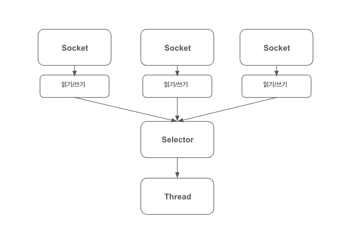

# netty-study

### Java 네트워킹

```java
public class SocketApplication {

    private static final int port = 8088;

    public static void main(String []args) {
        ServerSocket serverSocket = null;
        try {
            serverSocket = new ServerSocket(port);
            // accept() 호출로 연결될 때까지 진행을 블로킹한다.
            Socket clientSocket = serverSocket.accept();
            
            // 스트림 객체를 생성한다.
            // 문자 입력 스트림에서 텍스트를 읽는다.
            BufferedReader in = new BufferedReader(
                    new InputStreamReader(clientSocket.getInputStream())
            );
            // 객체의 포매팅된 표현을 테긋트 출력 스트림으로 출력한다.
            PrintWriter out = new PrintWriter(clientSocket.getOutputStream(), true);
            
            // 처리 루프를 시작한다.
            String request, response;
            // readLine() 을 통해 문자열을 읽을 때까지 진행을 블로킹한다.
            while ((request = in.readLine()) != null) {
                // 종료 신호가 들어오면 루프를 종료한다.
                if ("Done".equals(request)) {
                    break;
                }

                // client 요청을 처리한다.
                response = processRequest(request);
                out.println(response);
            }
        } catch (IOException e) {
            e.printStackTrace();
        }
    }

    private static String processRequest(String request) {
        return request;
    }
}

```

- 위의 코드는 JAVA API (java.net) 으로 Socket API 패턴의 예시이다.
- Socket API 는 블로킹 시스템 호출 방식으로 한 번에 한 연결만 처리한다. 
- 1개의 쓰레드가 1개의 연결만 처리하는 것을 의미하며, 연결이 종료되기 전까지 쓰레드는 대기상태로 유지된다.
- 각 쓰레드는 스택 메모리를 할당하는데, 기본 크기는 64KB 에서 1MB 정도 차지할 수 있다.
- JVM (Java virtual machine) 은 물리적으로 많은 수의 쓰레드를 지원하지만, 1만개 정도의 동시 접속이 진행될 때에는 컨텍스트 전환에 대한 오버헤드가 문제가 될 수 있다.

<br />


### JAVA NIO (new input output)

- 네트워크 소켓 라이브러리에는 네트워크 리소스 사용률을 세부적으로 제어할 수 있는 논블로킹(non-blocking) 호출이 포함되어 있다.
- setsockopt() 를 이용하면 데이터가 없을 때, 즉 블로킹 호출이라면 진행을 블로킹할 상황에서 읽기/쓰기 호출이 즉시 반환되도록 소켓을 구성할 수 있다.
- 시스템의 이벤트 통지 API 를 이용해 논블로킹 소켓의 집합을 등록하면 읽거나 기록할 데이터가 준비됐는지 여부를 알 수 있다.


<br />

### Selector



- java.nio.channels.Selector 클래스는 자바의 논블로킹 입출력 구현의 핵심, 논블로킹 Socket 의 집합에서 입출력이 가능한 항목을 지정하기 위해 이벤트 통지 API 를 이용한다.
- 하나의 쓰레드로 여러 동시 연결을 처리할 수 있다.
- 적은 수의 쓰레드로 더 많은 연결을 처리할 수 있으므로 메모리 관리와 컨텍스트 전환에 따르는 오버헤드가 감소한다.
- 입출력을 처리하지 않을 때는 쓰레드를 다른 작업에 활용할 수 있다.
- 그러나 직접 자바의 NIO API 를 이용해 네트워크 프로그래밍을 진행할 수 있지만 안정적인 네트워크 프로그래밍을 하기 어렵다.

<br />

### Netty

- 설계
  - 단일 API 로 블로킹과 논블로킹 방식의 여러 전송 유형을 지원
  - 단순하지만 강력한 스레딩 모델, 진정한 비연결 데이터그램 소켓 지원
  - 재사용 지원을 위한 논리 컴포넌트 연결

- 이용 편이성
  - javadoc 과 광범위한 예제, JDK 1.6 을 제외한 추가 의존성 없음

- 성능
  - 코어 자바 API 보다 높은 처리량과 짧은 지연 시간, 폴링과 재사용을 통한 리소스 소비 감소, 메모리 복사 최소화

- 견고성
  - 저속, 고속 또는 과부하 연결로 인한 OutOfMemoryError 가 발생하지 않음
  - 고속 네트워크 상의 NIO 애플리케이션에서 일반적인 읽기/쓰기 불균형이 발생하지 않음

- 보안
  - 완벽한 SSL/TLS 및 StarTLS 지원, 애플릿이나 OSGi 같은 제한된 환경에서도 이용 가능

<br />

### 비동기식 이벤트 기반 네트워킹

- 발생하는 이벤트에 대해 언제든지, 순서에 관계없이 응답할 수 있어야 한다.
- 증가하는 작업량에 맞게 적절히 처리할 수 있는 시스템, 네트워크, 프로세스의 능력 또는 이러한 작업량 증가에 맞게 규모를 늘리는 능력
- 셀렉터는 적은 수의 스레드로 여러 연결에서 이벤트를 모니터링할 수 있다.

<br />

### 네티의 핵심 컴포넌트

- Channel
  - 하나 이상의 입출력 작업(읽기 또는 쓰기)을 수행할 수 있는 하드웨어 장치, 파일, 네트워크 소켓, 프로그램 컴포넌트와 같은 엔티티에 대한 열린 연결


- Callback
  - 다른 메서드로 자신에 대한 참조를 제공할 수 있는 메서드
  - 다른 메서드에서 이 참조가 가리키는 메서드를 필요할 때 호출할 수 있다.
  - 관심 대상에게 작업 완료를 알리는 가장 일반적인 방법
  - channelActive(ChannelHandlerContext ctx)


- Future
  - 작업이 완료되면 이를 애플리케이션에게 알리는 방법
  - ChannelFuture 에는 ChannelFutureListener 인스턴스를 등록할 수 있어 작업 완료 여부를 리스너로 알 수 있다.


- Event, Handler
  - 이벤트 동작 : 로깅, 데이터 변환, 흐름 제어, 애플리케이션 논리
  - 인바운드 이벤트 : 연결 활성화 또는 비활성화, 데이터 읽기, 사용자 이벤트, 오류 이벤트
  - 아웃바운드 이벤트 : 원격 피어로 연결 열기 또는 닫기, 소켓으로 데이터 쓰기 또는 플러시

